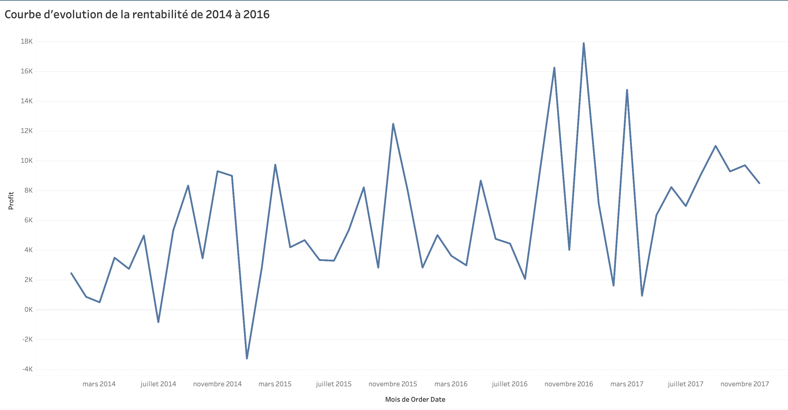
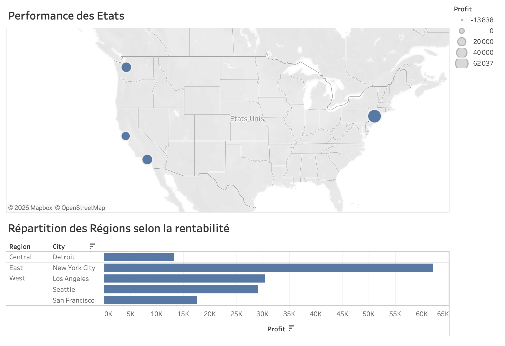
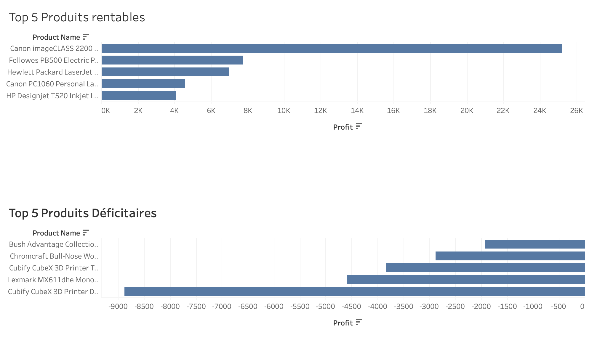
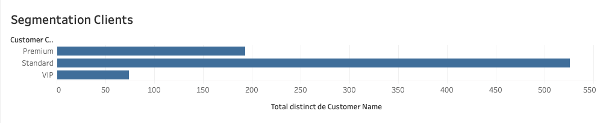

#  Superstore Sales & Profit Analysis (SQL + Tableau)

##  Project Overview

This project analyzes the performance of a retail company using the Superstore dataset.  
The goal is to understand sales trends, profitability, customer segments, and regional performance.

The analysis is performed using **SQL for data extraction and transformation**, and **Tableau for data visualization**.

---

##  Objectives

The main objectives of this project are:

- Analyze sales and profit evolution over time
- Identify the most and least profitable regions
- Determine top-performing and underperforming products
- Understand customer segment profitability

---

##  Tools Used

- SQL (PostgreSQL)
- Tableau (Data Visualization)
- Superstore dataset

---

##  Key Analyses

### 1. Sales & Profit Evolution Over Time
A time series analysis was performed to observe trends in sales and profit over months and years.

Insight: Helps identify growth trends and seasonal patterns.

---

### 2. Regional Performance Analysis
A geographic analysis was conducted to identify the most and least profitable regions and states.

- Profit distribution by region
- State-level performance using a map visualization

Insight: Profit is concentrated in specific regions, while others show weaker performance.

---

### 3. Product Performance Analysis
Products were ranked based on profitability:

- Top 5 most profitable products
- Bottom 5 least profitable (loss-generating) products

Insight: A small number of products generate most of the profit, while some products create losses.

---

### 4. Customer Segment Analysis
Customer segments were analyzed based on total profit contribution.

- VIP
- Premium
- Standard

Insight: One segment dominates overall profitability.

---

##  Visualizations

### 🔹 Overview Dashboard

### 🔹 Regional Analysis

### 🔹 Product Performance

### 🔹 Segmentation

---

##  Key Insights

- The West region is the most profitable overall
- Certain states underperform significantly compared to others
- A small number of products generate a large share of total profit, with the Canon imageCLASS 2200 significantly outperforming all other products.
- The company's largest losses are concentrated in a small number of products, particularly the Cubify CubeX 3D Printer line, suggesting opportunities for product portfolio optimization.
- Profit trends show fluctuations over time with seasonal patterns

---

##  Skills Demonstrated

- SQL Aggregations (SUM,AVG,COUNT)
- GROUP BY
- CASE WHEN
- LAG
- CTE
- Data visualization with Tableau
- Tableau Dashboard Design

---

##  How to Use This Project

1. Clone the repository
2. Explore SQL queries in the `/sql` folder
3. Open Tableau dashboard or view screenshots in `/dashboard`
4. Read insights and conclusions

---

##  Dataset

Superstore dataset (retail sales data including orders, profit, sales, customers, and regions)

---

##  Author

Data analysis project built for portfolio and job applications in data analytics.
